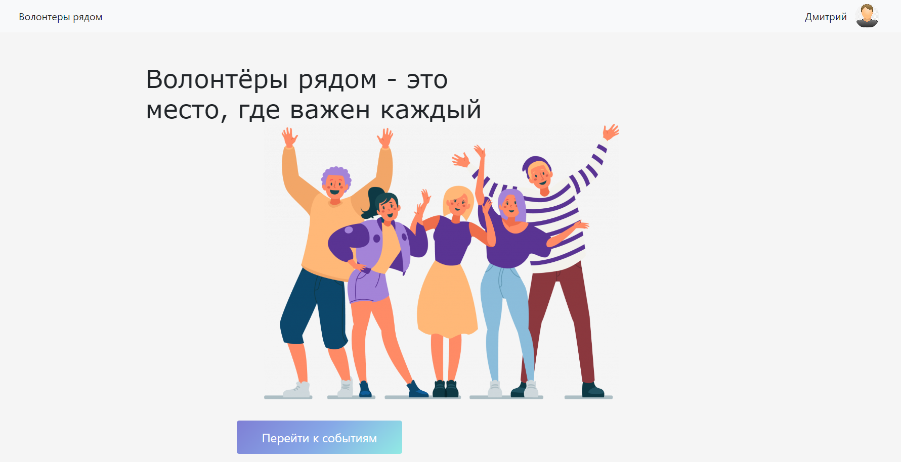
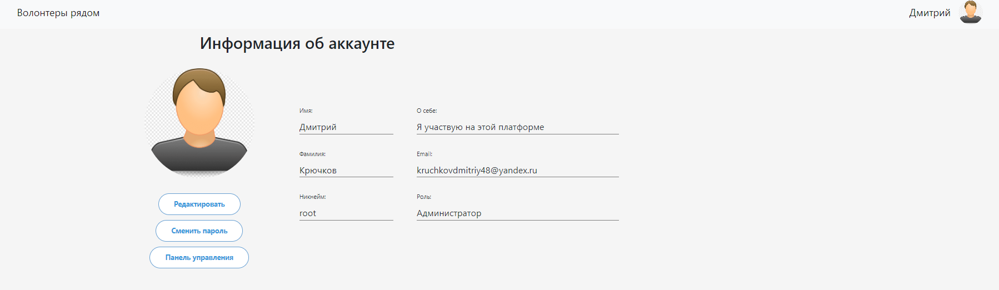

# Веб приложение "Волонтёры рядом"

 Данный проект является веб приложением на MSA.
Оно призвано собирать группы добровольцев для
оказания помощи в местных благотворительных 
организациях и социальных учреждениях. На платформе 
пользователи могут просматривать, присоединяться и предлагать события.
Администрация просматривает все предложенные новости и выбирает подходящие.
Пользователи могут быть заблокированы за непристойное поведение на платформе
или повышены до прав модератора по доверию администрации

# Архитектура проекта

Архитектура проекта представлена ниже. В него входит CI CD Pipeline и 5 контейнеров docker.

# Используемые технологии в проекте:
 ##### Flask
 ##### FastAPI
 #### Pytest
 #### SMTPlib
 #### Gitlab CI
 #### Docker & docker-compose
 #### Poetry
 #### ORM (Sqlalchemy)
 #### PostgreSQL
 #### Pgadmin4
 #### API Telegram
 #### Python
 #### Bash
 #### HTML
 #### CSS
 #### Redis
 #### Poetry

# Состав проекта
Данное приложение состоит из 5 микросервисов и CI/CD-пайплайна описанных ниже.

## 0 — CI/CD пайплайн
### Описание
Изначально приложение разрабатывалось на self-hosted GitLab CI. Но вскоре было решено перейти на GitHub Actions.
Пайплайн содержит в себе 4 стадии:
* Linting(с помощью Ruff)
* Testing(с помощью Pytest)
* Deploy(с помощью docker-compose)
* Notify(с помощью Bash и Telegram Bot API)
При отработке пайплайна в Телеграмм приходит сообщение через бота с результатом работы.

### Используемые технологии
* GitHub Actions
* GitLab CI
* Ruff
* Pytest
* Docker compose
* Telegram API
* Bash

## 1 — Сервис кеширования
### Описание
Redis-контейнер принимающий CRUD операции от веб приложения.
### Используемые технологии
* Redis
* Docker

## 2 — Сервис базы данных PostgreSQL
### Описание
PostgreSQL-контейнер принимающий CRUD операции от веб приложения.
### Используемые технологии
* PostgreSQL
* Docker

## 3 — Сервис управления базой данных через веб интерфейс
### Описание
PgAdmin4-контейнер автоматически подключающийся к PostgreSQL.
### Используемые технологии
* PgAdmin4
* Docker

## 4 — Сервис рассылки сообщений на почту
### Описание
RESTful контейнер созданный на базе образа python:3.11-alpine. Принимает запросы на отправку через RestAPI
с помощью фреймворка FastAPI. Отправляет сообщения по SMTP используя данные для авторизации из переменных окружения.
### Используемые технологии
* FastAPI
* SMTPlib
* Docker

## 5 — Веб приложение
### Описание
Веб приложение работающее на фреймворке Flask, взаимодействующее с пользователями.
Запросы к БД осуществляются через Sqlalchemy.
Для кеширования запросов к БД используется Redis.

### Используемые технологии
* Flask
* Python
* HTML
* CSS
* Sqlalchemy
* psycopg2
* Redis
* Docker
* RestAPI
### Скриншоты приложения

### Результат рассылки:
